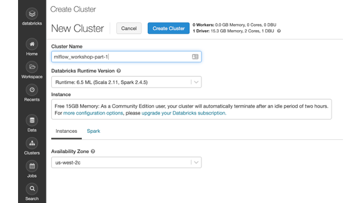
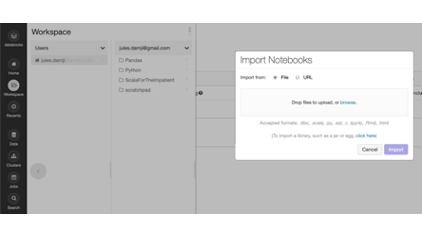

 Managing the Complete Machine Learning Lifecycle with MLflow
=============================================================

Part 2 of 3
-----------
Other parts:
- [Part 1](https://github.com/dmatrix/mlflow-workshop-part-1)
- [Part 3](https://github.com/dmatrix/mlflow-workshop-part-3)

Content for the MLflow Series
-----------------------------
Machine Learning (ML) development brings many new complexities beyond the traditional software development lifecycle. Unlike in traditional software development, ML developers want to try multiple algorithms, tools and parameters to get the best results, and they need to track this information to reproduce work. In addition, developers need to use many distinct systems to productionize models.

To solve these challenges, [MLflow](https://mlflow.org), an open source project, simplifies the entire ML lifecycle. MLflow introduces simple abstractions to package reproducible projects, track results, 
encapsulate models that can be used with many existing tools, and central respositry to share models,
accelerating the ML lifecycle for organizations of any size.

Goal and Objective
------------------
Aimed at beginner or intermediate level, this three-part series aims to educate data scientists or ML developer in how you 
leverage MLflow as a platform to track experiments, package projects to reproduce runs, use model flavors to deploy in diverse environments, and manage models in a central respository for sharing.

What you will learn
-------------------
Understand the four main components of open source MLflow——MLflow Tracking, MLflow Projects, MLflow Models, and Model Registry—and how each compopnent helps address challenges of the ML lifecycle.
 * How to use [MLflow Tracking](https://mlflow.org/docs/latest/tracking.html) to record and query experiments: code, data, config, and results.
 * How to use [MLflow Projects](https://mlflow.org/docs/latest/projects.html) packaging format to reproduce runs
 * How to use [MLflow Models](https://mlflow.org/docs/latest/models.html) general format to send models to diverse deployment tools.
 * How to use [Model Registry](https://mlflow.org/docs/latest/model-registry.html) for collaborative model lifecycle management
 * How to use [MLflow UI](https://mlflow.org/docs/latest/tracking.html#tracking-ui) to visually compare and contrast experimental runs with different tuning parameters and evaluate metrics


Instructor
-----------

- [Jules S. Damji](https://www.linkedin.com/in/dmatrix/) [@2twitme](https://twitter.com/2twitme) 
---


MLflow workshop part 2
----------------------

In this part 2, we will cover:
 * Concepts and motivation behind MLflow Projects and Models
 * Tour of the the MLflow Project and Model API Documentation
 * How to execute and reproduce MLflow Projects in the Databricks Community Edition (DCE)
 * Load PyFunc Model Flavor and score 
 * Build an MLflow Project and share it for reproducible runs
 * Use the MLflow UI on the DCE

Prerequisites
-------------
* [Part 1](https://github.com/dmatrix/mlflow-workshop-part-1) of this series
*  Before the session, please pre-register for [Databricks Community Edition](https://databricks.com/try-databricks)
* Knowledge of Python 3 and programming in general
* Preferably a UNIX-based, fully-charged laptop with 8-16 GB, with a Chrome or Firefox browser
* Familiarity with GitHub, git, and an account on Github
* Some knowledge of Machine Learning concepts, libraries, and frameworks 
     * scikit-Learn
     * pandas and Numpy
     * matplotlib
     * keras/TensorFlow
* (**optional for part-2**) PyCharm/IntelliJ or choice of syntax-based Python editor
* (**optional for part-2**) pip/pip3 or conda and Python 3 installed
* (**optional for part-2**) Knowledge on how to use [conda](https://docs.conda.io/projects/conda/en/latest/user-guide/install/) or create [pipenv](https://pypi.org/project/pipenv/) enviroments 
* Loads of virtual laughter, curiosity, and a sense of humor ... :-)

Obtaining the Tutorial Material
--------------------------------

Familiarity with git is important so that you can get all the material easily during the tutorial and
workshop as well as continue to work on in your free time, after the session is over.

```git clone git@github.com:dmatrix/mlflow-workshop-part-2.git or git clone https://github.com/dmatrix/mlflow-workshop-part-2.git```

Documentation and other Resources
---------------------------------

This tutorial will refer to documentation: 

1. [MLflow](https://mlflow.org/docs/latest/index.html)
3. [Numpy](https://numpy.org/devdocs/user/quickstart.html)
4. [Pandas](https://pandas.pydata.org/pandas-docs/stable/reference/index.html)
5. [Scikit-Learn](https://scikit-learn.org/stable/index.html)
6. [Keras](https://keras.io/optimizers/)
7. [TensorFlow](https://tensorflow.org)
8. [Matplotlib](https://matplotlib.org/3.2.0/tutorials/introductory/pyplot.html)
9. Loads of basic and advanced [MLflow Examples](https://github.com/amesar/mlflow-examples) from Andre Mesarovic
10. How to use MLflow in your favorite [Python IDE with Keras](https://databricks.com/blog/2018/08/23/how-to-use-mlflow-to-experiment-a-keras-network-model-binary-classification-for-movie-reviews.html)

How to get started
------------------
We will walk through this during the session, but please sign up for [Databricks Community Edition](https://databricks.com/try-databricks) before the session :

1. ``` git clone git@github.com:dmatrix/mlflow-workshop-part-2.git ```
2. Use this [URL](https://community.cloud.databricks.com/login.html) to log into the Databricks Community Edition


3. Create a ML Runtime 6.5 Cluster



4. In the brower: 
  * (1) Go the GitHub **notebooks** subdirectory
  * (2) Download **MLFlow-CE-Part2.dbc** file on your laptop


5. Import the **MLFlow-CE-Part2.dbc** file into the Databricks Community Edition



Let's go!


Homework/Lab Assignment
-----------------------

Using what we have learning in this session:
 * Improve the Keras Model with different parameters
  * Increase the size of training data
  * Use train/split and validation data
  * More input_units to the NN Dense layer
  * Run at least three experiments
  * Compare the runs and metrics
 * Use one of the models explored in [Part 1](https://github.com/dmatrix/mlflow-workshop-part-1) and build an MLflow GitHub Project
    * Supply different arguments as model parameters
 * Or Take one of your ML project and covert it into MLflow Project
     
Cheers,

Jules
